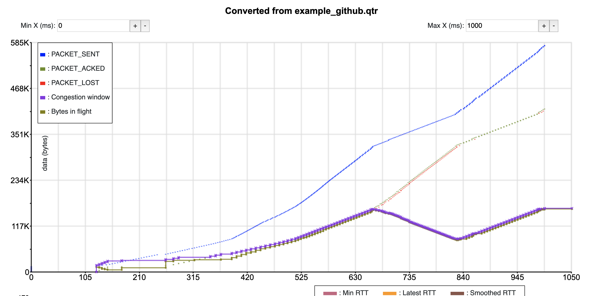

# DEPRECATED
This repository is deprecated. The tooling was moved to and developed further in the qvis project (https://github.com/quiclog/qvis and https://qvis.edm.uhasselt.be/). That new setup does not allow the direct import of the quictrace format anymore though. If you still need that feature, please open an issue in the qvis repository.

# quic-trace to qlog
Tooling to go from the quic-trace format to the qlog format.

Currently, this is a standalone, in-browser converter with a simple visualization.
It is intended as a general example of how to go from one QUIC/HTTP3 logging format to qlog and how to write tools on top of qlog. 

A example of what the visualization looks like:

A live demo can be found at: [https://quic.edm.uhasselt.be/qtr-to-qlog/](https://quic.edm.uhasselt.be/qtr-to-qlog/).

To run locally, simply clone the repository and double click index.html (no fancy build steps or anything required).
The "load example github file" will not work when running locally (because of CORS issues), see the online demo for that.
Only tested in Google Chrome. 
